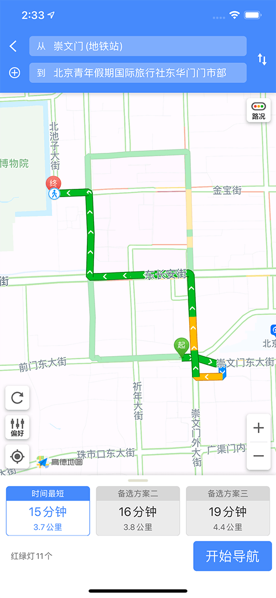

# works_amap_map

高德地图通用插件,调用原生地图控件，可以选择地点，显示地点以及导航，不支持地图添加标签等复杂操作.

## Screenshots

 
 

##usage

# 引入

```yaml
  dependencies:
    flutter:
      sdk: flutter
    works_amap_map:
    #本地路径
      path: /**/flutter_works_amap_map
#或者git地址
#	  git:
#       url: git://github.com/cdworks/flutter_works_amap_map.git
```

# ios配置
 - 在info.plist 文件中添加 AMapkey字段
 - 在info.plist 文件中添加 NSLocationAlwaysUsageDescription 或者 NSLocationWhenInUseUsageDescription权限
 - 在info.plist 文件中添加 LSApplicationQueriesSchemes 包括 iosamap comgooglemaps baidumap qqmap 分别支持ios原生地图，谷歌地图，百度地图，qq地图

# android配置 
 - 在AndroidManifest.xml中增加 meta-data android:name="com.amap.api.v2.apikey" android:value="amapkey"

# 示例
```dart
//单次定位

WorksAmapMap.startLocationOnce().then((value)
    {
      if(!mounted)
        return;

      if(value != null)
      {

        int code = value['code'];  //0 表示定位成功
        // value中包括的字段包括 address: 地址拼装信息 province 省 city 市 district 区 msg 错误信息 lat 纬度 lon 经度 ，注意省市区可能为空
        if(code == 0)
        {
          print('location value is$value');
            setState(() {
              isError = false;
              cityName = value['city'];
            });
        }
        else
        {
          isError = true;
          Toast.show('获取定位失败! code:$code msg:${value['msg']}', context,gravity: Toast.CENTER,backgroundRadius: 8,duration: Toast.LENGTH_LONG);
        }
      }
      else
      {
        isError = true;
        Toast.show('获取定位失败!', context,gravity: Toast.CENTER,backgroundRadius: 8);
      }

    });


//选点 static Future<Map> startLocationMap(int barColor ,int titleColor)  //barColor和titleColor 导航栏背景色以及标题颜色 

final addressInfo = WorksAmapMap.startLocationMap(CupertinoTheme.of(context).barBackgroundColor.value,CupertinoTheme.of(context).primaryColor.value);
if(addressInfo != null)
{
   double latitude = addressInfo['lat'];   // lat 纬度 
   double longitude = addressInfo['lon'];  // lon 经度
   String locationAddress = addressInfo['address'];   // 地址拼装信息
   if(latitude != null && longitude != null && locationAddress != null)
   {

   }
}


//显示地图点以及导航 static void startPotMapMap(int barColor ,int titleColor,Map locationInfo) barColor和titleColor 导航栏背景色以及标题颜色 

WorksAmapMap.startPotMapMap(CupertinoTheme.of(context).barBackgroundColor.value,CupertinoTheme.of(context).primaryColor.value,{
          "lat":locationMessageBody.latitude,
          "lon":locationMessageBody.longitude,
          "name":addressInfo[0], //地点名称
          "address":addressInfo[1]  //地点地址
        });

```